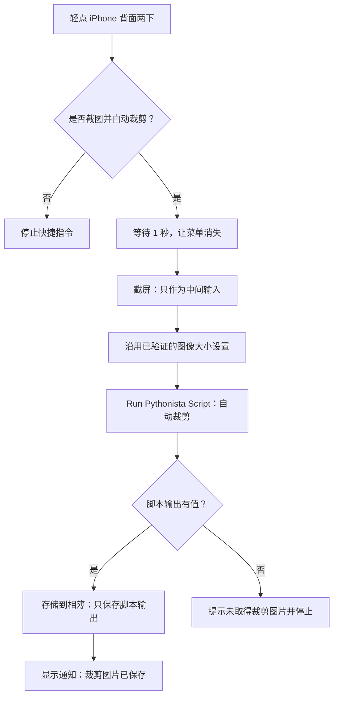

# autoScreenshot：iPhone 自动截图裁剪

轻点手机背面两下，确认后截取当前画面，自动裁剪外围留边，只将处理后的新图片保存到相册。使用 iOS 快捷指令与 Pythonista 3，无需服务器。

## 1. 安装脚本

1. 将 `crop_screenshot.py` 传到 iPhone 的“文件”App（例如通过 iCloud Drive）。
2. 打开 Pythonista，进入本地脚本列表，点击“＋”→“Import…”，导入该文件。
3. 后续脚本更新时重新导入并替换旧版，在快捷指令中确认选中的脚本正确。手机不需要安装 `requirements.txt`。

如果现有快捷指令已经能预览裁剪图片，无需重新导入脚本，直接复制该快捷指令进行下面的设置。

## 2. 完整流程图

脚本抛出错误时快捷指令会在该动作处停止，不会执行后面的保存。图中的“输出有值”判断只检查空输出，并不负责捕获运行错误或判断裁剪是否准确。

## 3. 配置快捷指令

复制已经跑通的测试快捷指令，命名为“截图裁剪”。保留其中已能输出图片的 Pythonista 配置；移除“选择照片”和末尾的“快速查看”，按以下结构整理动作。

### A. 添加确认菜单

在最前面添加“从菜单中选取”（Choose from Menu）：

- 提示：**是否截图并自动裁剪？**
- 选项：**是**、**否**。

下面 B 部分的全部动作放在“是”分支内部，不要放到“结束菜单”之后。

### B. “是”分支：截图、处理、保存

#### ① 等待

添加“等待”，设为 **1 秒**，让确认菜单退出后再截屏。如果仍截到弹窗，可适当增加等待时间。

#### ② 截屏

添加“截屏”（Take Screenshot）。不要在这里添加“存储到相簿”，也不要使用“获取最新照片”代替截屏。

#### ③ 图像大小设置

沿用已经成功的配置，不要在串联流程时同时更改处理尺寸：

- 如果原流程有“调整图像大小”，保留它，将输入改为②的截图。例如宽度 **600**、高度**自动**。
- 如果原尺寸已能正常处理且没有缩图动作，就跳过此步，直接把截图传给 Pythonista。

**缩图会降低最终图片分辨率。** 宽度设为 600 后，裁剪是在这张 600 像素宽的图片上进行，不会自动恢复成原图清晰度。不要通过裁完再放大来补偿。

#### ④ Run Pythonista Script

搜索 Pythonista，使用“Run Pythonista Script”，不要选择旧的“Run Script / Edit Script”。展开选项：

| 选项 | 设置 |
|---|---|
| Script | 本地 `crop_screenshot.py` |
| Inline Script | 关闭（若显示） |
| Arguments | 留空；不要填 `diagnose` |
| Input Files | ③的调整大小结果；没有③时选择②的截图 |
| Run in Pythonista | **关闭** |
| Show When Run | **关闭** |

所有输入均通过“选择变量”绑定前面动作的输出，不要手动输入“截图”或“Script Output”等文字。删除、替换原来的“选择照片”后，务必重新检查 `Input Files`。

#### ⑤ 检查输出并保存

添加“如果”，输入选择④的 **Script Output（脚本输出）**，条件设为“有任何值”（Has Any Value；名称可能随系统语言略有不同）。

在“如果有值”分支内：

1. 添加“存储到相簿”（Save to Photo Album）。**保存对象明确选择④的脚本输出**，而不是截图、缩图或“如果”的结果。
2. 选择目标相册。可以用默认相册，也可先在“照片”App 新建“自动裁图”相册，再在这里选中。
3. 添加“显示通知”：**裁剪图片已保存**。通知必须放在保存动作之后。

在“否则”分支内：

1. 添加“显示提醒”：**未取得裁剪图片，本次未保存**。
2. 添加“停止此快捷指令”，或“停止并输出”且输出留空。

结束“如果”。正式使用时不再添加“快速查看”，确认截图后即可自动处理并保存。

### C. “否”分支：直接退出

添加“停止此快捷指令”，或“停止并输出”且输出留空。不截图、不处理、不保存。

## 4. 绑定轻点背面并使用

1. 打开“设置”→“无障碍”→“触控”→“轻点背面”→“轻点两下”。
2. 在快捷指令列表选择 **“截图裁剪”**，不是系统自带的“截屏”。
3. 回到小红书、抖音、Instagram 等目标 App，展开图片；视频建议先暂停。
4. 轻点手机背面两下，选择“是”，等待保存通知。
5. 在“照片”App 查看新生成的裁剪图片。

首次运行按系统提示授予必要权限。不要停留在快捷指令编辑界面测试实时截屏，否则截到的可能是编辑器而非目标 App。

首次完整使用检查：

- 选择“否”：相册不增加照片。
- 选择“是”：相册只增加一张裁剪结果，图片中没有确认菜单。
- 保存的不是原始截图，且裁剪没有删掉想保留的内容。

**无需删除原图动作。** 快捷指令内截屏的结果不先写入图库，只有裁剪结果入库。脚本和快捷指令都不删除已有照片；普通按键截屏、之前的选图测试所用照片不在清理范围内。传图过程中仍可能存在系统临时文件，它们不等于相册中的原图。

## 5. 脚本直接运行与排错

### 在 Pythonista 内直接预览

将 `IMG_2844.PNG` 放到 `crop_screenshot.py` 同目录，在编辑器点击运行三角形。脚本会生成 `IMG_2844.cropped.png` 并预览；重复运行使用编号新文件，不覆盖原图或旧结果。

这是本地预览模式，文件不会自动进入系统相册，也不会直接返回给快捷指令。日常背面轻点使用第 3 节的后台模式，不需要准备 `IMG_2844.PNG`。

### 常见问题

| 现象 | 检查 |
|---|---|
| Script Output 空白 | 确认 `Arguments` 留空、`Run in Pythonista` 关闭，并通过变量选择器绑定真正的脚本输出；Pythonista 的结果面板不等于独立“快速查看” |
| 提示只允许一张截图 | `Input Files` 必须只传一张图；不要把图片传入 `Arguments` |
| “与 App 通信出现问题” | 使用已验证的缩图设置重试，并查看脚本同目录的 `pythonista_diagnostic.log`；不要直接打开 `Run in Pythonista` 来替代后台模式 |
| 保存的还是原图 | “存储到相簿”的输入应为 Pythonista 输出，不是“截屏”或“调整图像大小”的输出 |
| 截图包含确认菜单 | 增加截屏前等待时间，并在目标 App 中通过背面轻点测试 |
| 无法定位图片区域 | 换全屏单图或留边更明确的画面；脚本不能保证任意页面都正确裁剪 |

如需仅查看检测报告，在测试指令的 `Arguments` 填 `diagnose`，后接“快速查看”，不要接保存相册；结束诊断后清空该参数。日志每次运行覆盖，失败后先保留日志再重试。

裁剪只处理外围区域，不恢复遮挡、屏幕外内容或原图分辨率，也不会移除画面内部的水印和字幕。
