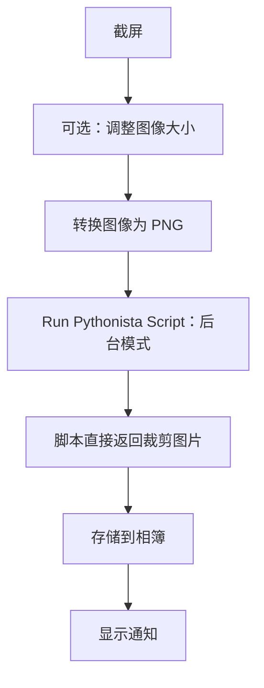
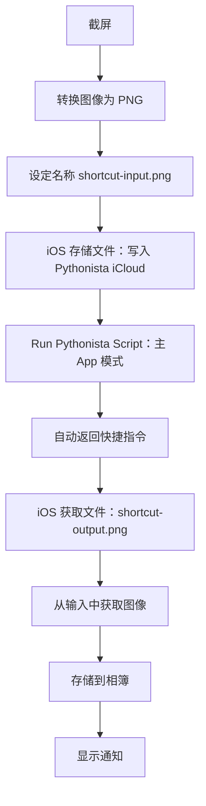

# autoScreenshot：iPhone 自动截图裁剪

轻点手机背面两下，确认后截取当前画面，自动裁掉外围界面和留边，只将处理后的新图片保存到相册。使用 iOS 快捷指令、Pythonista 3 和 Pillow，本地处理，不需要服务器。

脚本同时支持两种方案：

| 方案 | 特点 | 适用情况 |
|---|---|---|
| A：快捷指令直接传图 | 不切换 App，流程短 | 当前系统能稳定传递图片，或接受先缩小图片 |
| B：iCloud 文件桥接 | Pythonista 主 App 处理，稳定性更高 | 大图出现“与 App 通信出现问题”时，推荐使用 |

## 1. 安装脚本

建议统一使用 Pythonista 的 iCloud 脚本目录，两个方案可以共用同一份脚本：

1. 在 iPhone“文件”App中打开 Pythonista 的 iCloud Drive 目录。
2. 新建 `AutoScreenshot` 文件夹。
3. 将最新版 `crop_screenshot.py` 放入该文件夹。
4. 打开 Pythonista，切换到 iCloud 脚本库，确认可以打开 `AutoScreenshot/crop_screenshot.py`。

手机无需安装 `requirements.txt`，Pythonista 已内置 Pillow。

## 2. 公共触发流程

新建快捷指令“截图裁剪”，最外层使用“从菜单中选取”：

```text
轻点背面两下
↓
是否截图并自动裁剪？
├─ 否 → 停止快捷指令
└─ 是 → 等待 1 秒 → 进入方案 A 或方案 B
```

等待时间用于让确认菜单消失。如果最终截图仍包含菜单，可适当增加等待时间。

---

## 3. 方案 A：直接传图片处理

### 流程


```mermaid
flowchart TD
    A[截屏] --> B[可选：调整图像大小]
    B --> C[转换图像为 PNG]
    C --> D[Run Pythonista Script：后台模式]
    D --> E[脚本直接返回裁剪图片]
    E --> F[存储到相簿]
    F --> G[显示通知]
```

### 快捷指令设置

在“是”分支中依次添加：

1. **截屏**。
2. 可选：**调整图像大小**。如果原尺寸容易出现通信错误，可先使用已经验证的宽度（例如 600 像素，高度自动）。注意：这会降低最终图片分辨率。
3. **转换图像**：格式选择 PNG。
4. **Run Pythonista Script**：选择 `AutoScreenshot/crop_screenshot.py`。

Pythonista 动作配置：

| 选项 | 设置 |
|---|---|
| Arguments | **留空** |
| Input Files | 绑定第 3 步的 PNG，一次只传一张 |
| Run in Pythonista | **关闭** |
| Show When Run | **关闭** |

5. 第一次测试先添加 **快速查看**，输入绑定 Pythonista 的 Script Output。
6. 确认结果正确后，将快速查看替换为 **存储到相簿**。
7. 添加通知：`裁剪图片已保存`。

该模式日志以 `DIRECT_START` 开头，成功时最后一项为 `OUTPUT_DONE`。

### 限制

直接模式运行在 Pythonista 的快捷指令扩展中，可用内存和执行时间有限。若日志停在 `DETECT_BEGIN`、系统显示“与 App 通信出现问题”，或系统升级后媒体转换异常，改用方案 B。

---

## 4. 方案 B：iCloud 文件桥接

### 流程


```mermaid
flowchart TD
    A[截屏] --> B[转换图像为 PNG]
    B --> C[设定名称 shortcut-input.png]
    C --> D[iOS 存储文件：写入 Pythonista iCloud]
    D --> E[Run Pythonista Script：主 App 模式]
    E --> F[自动返回快捷指令]
    F --> G[iOS 获取文件：shortcut-output.png]
    G --> H[从输入中获取图像]
    H --> I[存储到相簿]
    I --> J[显示通知]
```

### 快捷指令设置

在“是”分支中依次添加：

1. **截屏**。
2. **转换图像**：格式选择 PNG。
3. **设定名称**：`shortcut-input.png`。
4. 使用 iOS 原生 **存储文件**，不要使用 `Add File to Pythonista`：
   - 输入：第 3 步的命名结果；
   - 关闭“询问存储位置”；
   - 目录：`iCloud Drive/Pythonista/AutoScreenshot`（以“文件”App实际显示名称为准）；
   - 开启“覆盖现有文件”。
5. **Run Pythonista Script**：选择 iCloud 中的 `AutoScreenshot/crop_screenshot.py`。

Pythonista 动作配置：

| 选项 | 设置 |
|---|---|
| Arguments | 纯文本 `shortcut-file` |
| Input Files | **留空** |
| Run in Pythonista | **开启** |
| Auto-Return to Shortcuts | **开启** |

6. Pythonista 会短暂打开，处理完成后自动返回快捷指令。
7. 使用 iOS 原生 **获取文件**或“获取文件夹中的文件”，读取：

```text
iCloud Drive/Pythonista/AutoScreenshot/shortcut-output.png
```

不要使用 `Get Pythonista File`。

8. 添加 **从输入中获取图像**；如果后续动作已经把文件识别为图片，可省略。
9. 第一次测试先添加 **快速查看**。
10. 确认结果正确后，将快速查看替换为 **存储到相簿**。
11. 添加通知：`裁剪图片已保存`。

### 固定文件

脚本和输入文件必须位于同一个 `AutoScreenshot` 目录：

| 文件 | 作用 |
|---|---|
| `crop_screenshot.py` | 裁剪脚本 |
| `shortcut-input.png` | 本次截图，每次覆盖 |
| `shortcut-output.png` | 裁剪结果，每次覆盖 |
| `.shortcut-output.tmp` | 原子写入使用的临时文件 |
| `pythonista_diagnostic.log` | 最近一次执行日志 |

脚本开始时先删除旧输出，成功写完临时文件后才替换正式输出；失败时不会保留上一张结果。

该模式日志以 `BRIDGE_START` 开头，成功时最后一项为 `SAVE_DONE`。

---

## 5. 绑定轻点背面

1. 打开“设置”→“无障碍”→“触控”→“轻点背面”→“轻点两下”。
2. 选择快捷指令 **“截图裁剪”**，不是系统自带的“截屏”。
3. 返回小红书、抖音、Instagram 等目标 App，展开图片。
4. 轻点背面两下，选择“是”，等待保存通知。

不要停留在快捷指令编辑页面测试，否则可能截到编辑器界面。

## 6. 为什么相册只新增裁剪结果

两种方案都只在最后执行一次“存储到相簿”，保存对象必须是 Pythonista 的处理结果：

- 方案 A：保存 Script Output；
- 方案 B：保存 `shortcut-output.png`。

原始截屏只作为快捷指令内部输入，不先写入照片图库，因此无需删除原图。脚本不会删除相册中已有照片。

## 7. 常见问题

| 现象 | 检查 |
|---|---|
| 直接模式提示“与 App 通信出现问题” | 先缩小图片；仍失败则改用 iCloud 文件桥接 |
| `WFPhotoMediaContentItem ... public.mpeg-4` | 先用“转换图像为 PNG”，并确保图片放在 `Input Files`，不是 `Arguments` |
| 直接模式提示只允许一张截图 | `Input Files` 一次只能传一张图片 |
| iCloud 中没有 `shortcut-input.png` | 检查“设定名称”、系统“存储文件”的目录和覆盖设置 |
| Pythonista 提示启动方式不正确 | 方案 A 的 Arguments 必须留空且 Run in Pythonista 关闭；方案 B 必须填 `shortcut-file` 且 Run in Pythonista 开启 |
| iCloud 输入存在但没有输出 | 查看 `pythonista_diagnostic.log` 最后一项 |
| 获取不到输出 | 先在“文件”App确认 `shortcut-output.png` 存在，再检查系统“获取文件”的固定路径 |
| 保存的还是原始截图 | 保存动作绑错变量；方案 A 保存 Script Output，方案 B 保存 `shortcut-output.png` |
| 截图包含确认菜单 | 增加截屏前等待时间 |
| 无法定位图片区域 | 换成全屏单图或留边更明显的画面 |

裁剪仅处理外围界面和留边，不会移除图片内容内部的水印、字幕或贴纸，也不能恢复被遮挡或屏幕之外的内容。
